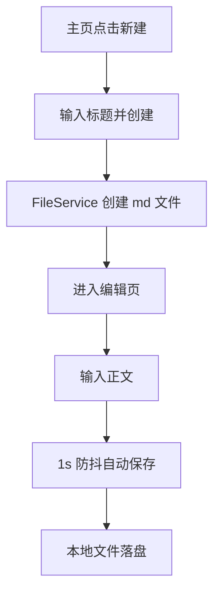
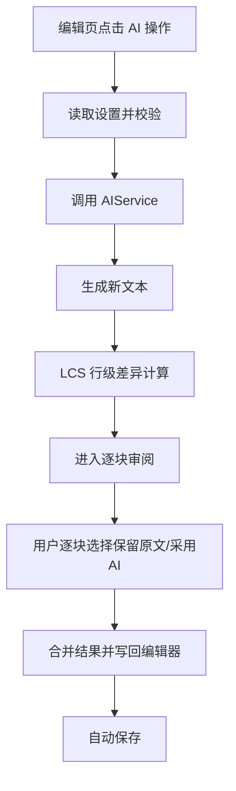
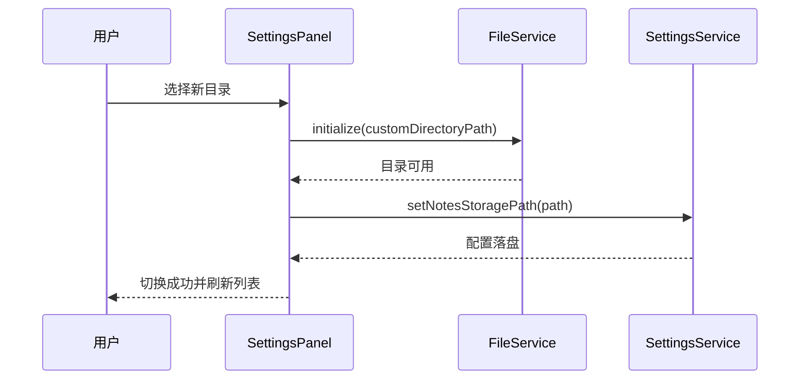
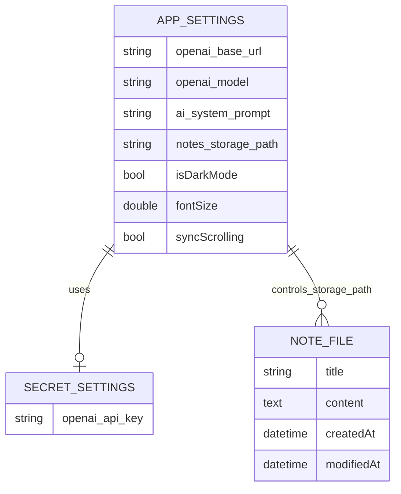

# NoteApp 详细设计

## 1. 设计目标与范围

### 1.1 目标

- 构建一个本地优先、低学习成本的 Markdown 笔记应用。
- 提供实时预览、自动保存、目录切换、全文检索等高频能力。
- 通过 OpenAI 协议兼容接口接入 AI 写作能力，并提供可审阅的安全应用机制。

### 1.2 范围

- 平台：Flutter 桌面/移动（当前工程重点为 Windows 桌面）。
- 核心模块：主页、编辑器、设置面板、文件存储、AI 服务、主题服务。
- 非目标：多人协作、云同步、关系型数据库、离线向量检索。

## 2. 总体架构设计

### 2.1 分层结构

- 表现层（UI）：主入口与页面组件
  - lib/main.dart
  - lib/screens/home_screen.dart
  - lib/screens/editor_screen.dart
  - lib/widgets/markdown_editor.dart
  - lib/widgets/markdown_preview.dart
  - lib/widgets/split_view.dart
- 领域模型层：
  - lib/models/note.dart
  - lib/models/settings.dart
- 服务层：
  - lib/services/file_service.dart
  - lib/services/ai_service.dart
  - lib/services/settings_service.dart
  - lib/services/theme_service.dart
- 基础能力：
  - 本地文件系统（Markdown 文件）
  - SharedPreferences（普通配置）
  - Flutter Secure Storage（敏感配置）

### 2.2 启动与依赖装配

启动顺序（main）：

1. 初始化 SettingsService，读取配置。
2. 根据配置决定笔记目录并初始化 FileService。
3. 初始化 ThemeService，加载主题偏好。
4. 装配 MyApp，进入 HomeScreen 或 EditorScreen 双态切换。

设计意图：

- 在应用启动阶段完成“存储路径”和“主题模式”准备，避免页面加载后再跳变。

## 3. 界面设计

## 3.1 页面与职责

### A. 主页 HomeScreen

主要区域：

- AppBar：主题切换、设置入口。
- 顶部卡片：可见笔记数量 + 搜索输入框。
- 笔记列表：标题、摘要预览、最近修改时间、删除菜单。
- 悬浮按钮：新建笔记。

交互重点：

- 搜索框使用 260ms 防抖，避免每个字符输入都触发重建过滤。
- 列表显示为空时提供空状态引导。
- 新建后立即进入编辑页。

### B. 编辑页 EditorScreen

主要区域：

- 顶部栏：返回、标题编辑、AI 操作菜单、手动保存。
- 状态栏：本地同步状态、字数统计、单双栏切换。
- 左侧侧边栏：笔记目录、过滤、折叠/展开、快速切换。
- 主编辑区：
  - 单栏模式：仅 Markdown 编辑。
  - 双栏模式：左编辑 + 右实时预览（可拖拽分割条）。
- AI 审阅区：当 AI 返回变更时进入逐块审阅模式。

交互重点：

- 内容变化 1s 自动保存（防抖）。
- 编辑滚动与预览滚动按比例同步。
- 切换笔记前静默保存当前内容，降低丢失风险。

### C. 设置面板 SettingsPanel

主要区域：

- 存储目录配置：选择目录、恢复默认。
- AI 配置：Base URL、API Key、Model、全局 System Prompt。
- 连接测试与保存。

交互重点：

- 配置校验先行（URL/Key/Model 非空）。
- API Key 使用安全存储。
- 目录切换后即时生效，并触发列表刷新。

## 3.2 典型使用流程

### 流程 1：新建并编辑笔记

1. 用户在主页点击“新建笔记”，输入标题后提交创建。
2. 系统调用 FileService 创建对应 md 文件，并初始化笔记对象。
3. 页面跳转到编辑页，用户开始输入正文内容。
4. 每次内容变化都会触发自动保存防抖计时器（1 秒）。
5. 若 1 秒内无新输入，系统执行保存并将内容写入本地文件。

### 流程 2：AI 改写并逐块审阅

1. 用户在编辑页选择 AI 操作（润色、摘要、续写或自定义改写）。
2. 系统先读取设置并校验 Base URL、API Key、Model 是否完整可用。
3. 校验通过后调用 AIService，请求生成新的文本结果。
4. 系统对原文与 AI 结果执行 LCS 行级差异计算，切分为多个变更块。
5. 用户逐块选择“保留原文”或“采用 AI”。
6. 系统按用户选择合并最终文本，写回编辑器并触发自动保存。

### 流程 3：切换笔记存储目录

1. 用户在设置面板选择新的笔记目录。
2. 设置面板先调用 FileService.initialize(customDirectoryPath) 检查并初始化目标目录。
3. 目录可用后，再调用 SettingsService.setNotesStoragePath 持久化新路径配置。
4. 配置写入成功后，界面提示切换成功并刷新笔记列表。
5. 该顺序确保“目录可用性”优先于“配置落盘”，避免无效路径被保存。

## 4. 数据库设计（本项目为“无传统数据库”）

## 4.1 存储方案说明

项目不采用 SQLite/MySQL 等传统数据库，采用三类持久化介质：

1. Markdown 文件（笔记正文）
2. SharedPreferences（普通设置）
3. SecureStorage（敏感配置）

理由：

- 本地优先与可迁移性优先，用户可直接管理 .md 文件。
- 配置项结构简单，键值存储即可满足。
- 减少维护成本，降低跨平台数据库兼容复杂度。

## 4.2 逻辑数据结构（表格式说明）

### A. NOTE_FILE（逻辑实体，对应 .md 文件）

| 字段       | 类型         | 来源               | 说明                       |
| ---------- | ------------ | ------------------ | -------------------------- |
| id         | String       | 运行时生成         | 业务对象标识（非持久主键） |
| title      | String       | 文件名             | 去除 .md 后得到            |
| content    | Text         | 文件内容           | Markdown 正文              |
| createdAt  | DateTime     | 文件 stat.changed  | 创建时间近似值             |
| modifiedAt | DateTime     | 文件 stat.modified | 最后修改时间               |
| tags       | List<String> | 当前未落盘         | 保留扩展字段               |

### B. APP_SETTINGS（SharedPreferences）

| Key                | 类型   | 默认值        | 说明                       |
| ------------------ | ------ | ------------- | -------------------------- |
| openai_base_url    | String | 空            | AI 接口基地址              |
| openai_model       | String | gpt-3.5-turbo | 模型名                     |
| ai_system_prompt   | String | 空            | 全局系统提示词             |
| notes_storage_path | String | 空            | 自定义目录，空表示默认目录 |
| isDarkMode         | bool   | false         | 主题偏好                   |
| fontSize           | double | 14.0          | 编辑字号                   |
| syncScrolling      | bool   | true          | 预览同步滚动开关           |

### C. SECRET_SETTINGS（SecureStorage）

| Key            | 类型   | 说明                          |
| -------------- | ------ | ----------------------------- |
| openai_api_key | String | API Key，敏感信息单独加密存储 |

## 4.3 ER/UML 逻辑关系图

该 ER 图说明本项目采用“文件 + 键值配置”的轻量数据架构，其中 APP_SETTINGS 决定存储路径与行为配置，SECRET_SETTINGS 独立保存敏感凭据，NOTE_FILE 作为笔记事实数据源。

## 4.4 范式与折中说明

存在刻意“违背完全范式”的设计：

- 笔记标题与文件名绑定，标题变更通过重命名文件实现。
- createdAt/modifiedAt 来源于文件系统元数据，未单独存储规范化时间表。

原因：

- 强化“文件即数据”的可见性与可迁移性。
- 避免引入额外元数据数据库，简化备份与手工编辑。

风险与约束：

- 同名标题需要冲突处理（已通过后缀计数实现）。
- 跨平台文件名合法字符需清洗（已做非法字符替换）。

## 5. 关键算法与关键技术

## 5.1 自动保存防抖

目标：在频繁输入时减少磁盘写入抖动，同时保证近实时保存。

机制：

- 每次编辑触发后取消旧计时器。
- 启动 1s 新计时器，计时结束执行静默保存。

收益：

- 降低 I/O 压力。
- 保持用户“几乎实时持久化”感知。

## 5.2 编辑-预览同步滚动

核心思路：按滚动比例映射。

- 记编辑区最大滚动为 maxEditor，预览区最大滚动为 maxPreview。
- 当前比例 ratio = editorOffset / maxEditor。
- 预览滚动目标 = ratio \* maxPreview。

并通过互斥标记避免递归触发。

## 5.3 AI 变更逐块审阅（核心难点）

流程：

1. 将原文与 AI 文本按行切分。
2. 使用 LCS 动态规划识别 equal / delete / insert。
3. 将连续非 equal 合并为“变更块”。
4. 用户逐块勾选“采用 AI”或“保留原文”。
5. 根据用户选择回放操作并合并为最终文本。

复杂度：

- 时间复杂度约 O(mn)（m、n 为行数）。
- 当任一文本超过阈值（700 行）时，降级为整块对比，避免 UI 卡顿。

价值：

- 避免 AI 全量覆盖导致误改。
- 使 AI 介入可控、可追踪、可回退。

## 5.4 长文本 AI 分片与分层摘要

问题：长文本一次调用容易超时或截断。

方案：

- 输入超阈值后按段落分片；超长段再按字符切片。
- 润色/改写：分片独立处理后拼接。
- 摘要：先分片摘要，再二次汇总生成总摘要。

收益：

- 提升成功率与稳定性。
- 兼顾长文本质量与响应时间。

## 5.5 自适应超时与自动续传

机制：

- 请求超时根据 prompt 长度和 maxTokens 动态估计，并限制在 30s~180s。
- 当 finish_reason 为 length 时自动发起“继续输出”请求，最多 3 轮。

收益：

- 减少大响应场景下的失败率。
- 降低“输出被截断”的用户感知。

## 5.6 文件名规范化与冲突消解

处理：

- 非法字符替换为下划线。
- 统一去除重复 .md 后缀。
- 同名文件自动追加 (1)、(2) 后缀。

价值：

- 保证跨平台文件系统兼容。
- 避免保存失败和数据覆盖。

## 6. 难点与痛点聚焦

1. AI 可控性与可解释性

- 通过逐块审阅机制解决“AI 改坏全文”的风险。

2. 本地文件模式下的一致性

- 通过防抖保存、切换前静默保存，降低数据丢失概率。

3. 长文本请求稳定性

- 通过分片、分层摘要、自适应超时、自动续传形成组合策略。

4. 用户可迁移需求

- 通过目录可切换和纯 .md 存储保证可移植性。

## 7. 可扩展设计建议

1. 元数据侧车文件

- 为每篇笔记增加 .meta.json，保存标签、创建时间、字数等，避免依赖文件系统时间。

2. 本地索引

- 引入轻量索引（如 sqlite/fts）加速大规模笔记检索，同时保留 .md 作为事实源。

3. 审阅历史

- 对 AI 审阅结果做版本快照，支持回滚与对比。

4. 同步开关下沉

- 将 syncScrolling 等 UI 行为设置透传到编辑器组件并持久化生效。

## 8. 与实现代码的对应关系

- 启动与装配：lib/main.dart
- 主页与设置：lib/screens/home_screen.dart
- 编辑器与 AI 审阅：lib/screens/editor_screen.dart
- 文件存储：lib/services/file_service.dart
- AI 能力：lib/services/ai_service.dart
- 设置存储：lib/services/settings_service.dart
- 主题系统：lib/services/theme_service.dart
- 编辑/预览/分栏组件：
  - lib/widgets/markdown_editor.dart
  - lib/widgets/markdown_preview.dart
  - lib/widgets/split_view.dart
